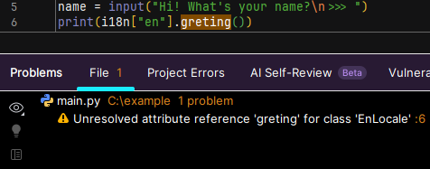
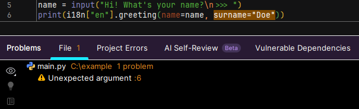
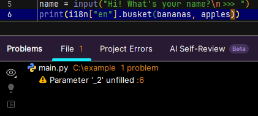
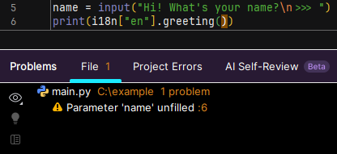

## What is it?
The CLI tool generates type stubs (`.pyi`) based on your translation files. 
This enables static type checking and IDE autocompletion for keys and string formatting arguments.

## Example
Imagine you have this structure:

```text
project_root/  
├── locales/  
│   └── en.yaml  
└── main.py  
```

Content of `en.yaml`:
```yaml
greeting: "Hello, {name}!"
basket: "You have {0} bananas, {1} apples, and {2} oranges in your basket."
```

Run the generator:
```bash
doti18n stub locales/
```

!!! note
    Stubs must be regenerated after any changes to localization files (adding keys, changing arguments, etc.).

### Results

**Autocompletion:**
Your IDE will now suggest available keys and methods.

<video width="80%" autoplay loop muted playsinline>
  <source src="/doti18n/assets/images/stub.mp4" type="video/mp4">
  Your browser doesn't support video
</video>

**Static Analysis:**
Type checkers (like mypy) will detect errors such as typos or mismatched formatting arguments.

*Typos:*

  

---
*Unexpected arguments:*



---
*Missing arguments:*






!!! warning "Virtual Environment"
    The generator writes the `__init__.pyi` file directly into the installed `doti18n` package directory.  
    **Always run this command inside a virtual environment [(venv)](https://docs.python.org/3/library/venv.html).** Modifying system-wide Python packages is strongly discouraged.

## Explicit types
You can also specify explicit types for your keys using the `__types__` key in your locale file. 
This is useful for cases where the generator cannot infer types from the string formatting.
You can use types directly from your codebase, and the generator will import them into the stub file.

=== "YAML"
    `locales/en.yaml`:
    ```yaml
    __types__:
      name: "str"
      user: "app.models.User"

    greeting: "Hello, {name}!"
    user_info: "User {user.name} has email {user.email}."
    ```

=== "JSON"
    `locales/en.json`:
    ```json
    {
        "__types__": {
            "name": "str",
            "user": "app.models.User"
        },
        "greeting": "Hello, {name}!",
        "user_info": "User {user.name} has email {user.email}."
    }
    ```

=== "XML"
    `locales/en.xml`:
    ```xml
    <locale>
        <__types__>
            <name>str</name>
            <user>app.models.User</user>
        </__types__>
        <greeting>Hello, {name}!</greeting>
        <user_info>User {user.name} has email {user.email}.</user_info>
    </locale>
    ```

=== "TOML"
    `locales/en.toml`:
    ```toml
    hello = "Hello, {name}!"
    user_info = "User {user.name} has email {user.email}."

    [__types__]
    name = "str"
    user = "app.models.User"
    ```


`__init__.pyi` will contain:
```python
# Generated via doti18n at ... UTC
from app.models import User

# other imports...
# __types__ namespace...

class EnLocale(LocaleTranslator):
    def greeting(self, *, name: str) -> str: ...
    def user_info(self, *, user: User) -> str: ...

# other stub code...
```


## Options

**Clean stubs:**
Remove previously generated type definitions.
```bash
doti18n stub --clean
```

**Set default locale:**
Specify which locale file should be used as the source of truth for generating types (default is `en`).
```bash
doti18n stub locales/ --lang fr
```